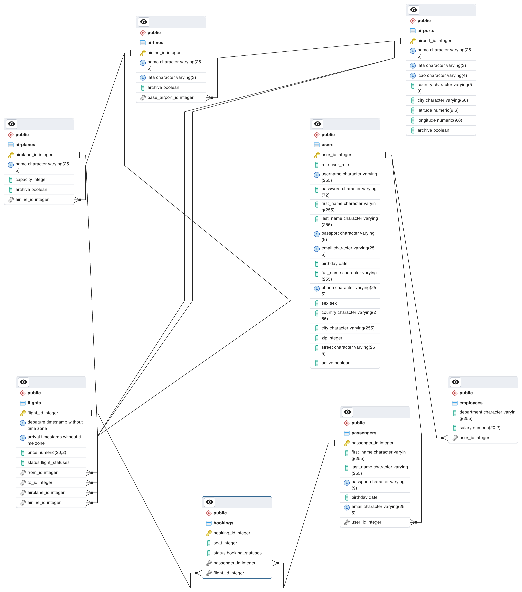

# Airport Travel Advisor

## Project Description

The project presents a travel advisory system for airports. When a traveler wants to book a flight from one location to another, the system provides information on available routes, flight times, layovers, and costs, even when there are no direct flights. It also suggests alternative routes.

## Table of contents

- [🚀 Install and run](https://github.com/amerkul/node-airport/tree/AIR-3-docker-database#install-and-run)
- [🌐 REST API](https://github.com/amerkul/node-airport/tree/AIR-3-docker-database#rest-api)
     - [🚪 Register and login](https://github.com/amerkul/node-airport/tree/AIR-3-docker-database#register-and-login)
     - [🏠 Airport info service](https://github.com/amerkul/node-airport/tree/AIR-3-docker-database#airports)
     - [⭐ Airline service](https://github.com/amerkul/node-airport/tree/AIR-3-docker-database#airlines)
     - [✈️ Airplane service](https://github.com/amerkul/node-airport/tree/AIR-3-docker-database#airplanes)
     - [💃 Passenger service](https://github.com/amerkul/node-airport/tree/AIR-3-docker-database#passengers)
     - [🧑‍💼 Employee service](https://github.com/amerkul/node-airport/tree/AIR-3-docker-database#employees)
     - [📆 Flight service](https://github.com/amerkul/node-airport/tree/AIR-3-docker-database#flights)
     - [✅ Booking service](https://github.com/amerkul/node-airport/tree/AIR-3-docker-database#bookings)
- [💣 Database](https://github.com/amerkul/node-airport/tree/AIR-3-docker-database#database)
     - [💻 Technology](https://github.com/amerkul/node-airport/tree/AIR-3-docker-database#technology)
     - [🖼️ Database schema](https://github.com/amerkul/node-airport/tree/AIR-3-docker-database#database-schema)
     - [📓 Tables ](https://github.com/amerkul/node-airport/tree/AIR-3-docker-database#tables)

## Install and run

Later

## REST API

### Register and login

1. Register 💛 (POST)
   > `http://localhost:3000/register`
   
   Body params
   | Param | Type | Required |
   |-------|------|------------|
   | firstName | String | True |
   | lastName | String | True |
   | username | String | True |
   | passport | String | True |
   | password | String | True |
   | email | String | True |
   | birthday | string | |
   | sex | string | |
   | country | string | |
   | zip | integer | |
   | string | string | |

   Responses

   🟢 201

   ```json
   {
    "id": 4,
    "username": "vera",
    "password": "",
    "role": "Passenger",
    "firstName": "First",
    "lastName": "Last",
    "passport": "MM3333333",
    "email": "dddddd@mail.ru",
    "fullName": "First Last"
  }

   🔴 409

   ```json
  {
     "status": 409,
     "error": "Conflict",
     "message": "Username exists"
  }
   ```

   🔴 400

   ```json
   {
    "code": 400,
    "message": "Not unique params  \n            dddddd@mail.ru, MM3333333"
  }
   ```
   
2. Login 💛 (POST)
   > `http://localhost:3000/login`
   
    Body params
   | Param | Type | Required |
   |-------|------|------------|
   | username | String | True |
   | password | String | True |

   username ~ email

   🟢 200

   ```json
   {
     "username": "amerkul",
     "token": "eyJhbGciOiJIUzI1NiIsInR5cCI6IkpXVCJ9.eyJzdWJqZWN0IjoiYW5uYSIsInJvbGUiOiJhZG1pbiIsImlzcyI6IjE2OTc1Mzk1Mjg2MTYiLCJleHAiOiIxNjk3NTM5ODI4NjE2In0=.6c742def1a56618ec0afeada5cce1a4c4ce1e26fb347862b87c2fc3cf76580f5"
   }
   ```

   🔴 401

   ```json
   {
     "status": 401,
     "error": "Unauthorised",
     "message": "Unauthorised"
   }
   ```

### Airports

1. List all airports 💚 (GET)
   > `http://localhost:3000/api/v1/airports`
   
   Returns a list of airports.

   Query params
   | Param | Type | description |
   |-------|------|------------|
   | ids[] | Integer | Fitler airports by IDs. Multiple IDs can be provided using an ampersand separated list. For example, ids[]=1&ids[]=2. |
   | name | String | Fitler airporsts by name. |
   | archive | Boolean | Filter by status |
   | country | String | Fitler airporsts by country. |
   | city | String | Filter airports by city. |
   | page | Integer | Filter airports by page. |
   | per_page | Integer | Filter airports by this value. |

   Responses
   
   🟢 200
   
   ```json
   {
     "airports" : [
       {
         "id": 1,
         "name": "National Airport Minsk",
         "archive": false,
         "country": "Belarus",
         "city": "Minsk",
         "latitude": 53.882222,
         "longitude": 28.030556,
         "iata": "MSQ",
         "icao": "UMMS"
       },
       {
         "id": 2,
         "name": "Brussels International Airport",
         "archive": false,
         "country": "Belgium",
         "city": "Brussels",
         "latitude": 50.846667,
         "longitude": 4.3525,
         "iata": "BRU",
         "icao": "EBBR"
       }
     ],
     "page": 1,
     "per_page": 10,
     "total_entries": 2,
     "total_pages": 1 
   }
   ```

2. Get airport info 💚 (GET)
   > `http://localhost:3000/api/v1/airports/{airport_id}`

   Get an airport.

   Path params
   | Param | Type | Required |
   |-------|------|------------|
   | airport_id | Integer | True |

   Responses
   
   🟢 200

   ```json
   {
     "id": 1,
     "name": "National Airport Minsk",
     "archive": false,
     "country": "Belarus",
     "city": "Minsk",
     "latitude": 53.882222,
     "longitude": 28.030556,
     "iata": "MSQ",
     "icao": "UMMS"
   }
   ```
   
   🔴 404

   ```json
   {
    "code": 404,
    "message": "Airport with id = 10 doesn't exist"
   }
   ```
   
3. Add the airport data 💛 (POST)
   > `http://localhost:3000/api/v1/airports`

   Create an airport.

   AUTHORIZATION
   | Header| Value |
   |-------|------|
   | Authorization | Bearer token |

   Body params
   | Param | Type | Required |
   |-------|------|------------|
   | name | String | True |
   | country | String | True |
   | city | String | True |
   | iata | String | True |
   | icao | String | True |
   | latitude | Float | |
   | longitude | Float | |

   Responses
   
   🟢 201
  
   ```json
   {
     "id": 1,
     "name": "National Airport Minsk",
     "archive": false,
     "country": "Belarus",
     "city": "Minsk",
     "latitude": 53.882222,
     "longitude": 28.030556,
     "iata": "MSQ",
     "icao": "UMMS"
   }
   ```
   
   🔴 400
   
   ```json
   {
    "code": 400,
    "message": "Invalid input params country = Test &country"
   }
   ```
   
5. Update airport info 💙 (PUT)
   > `http://localhost:3000/api/v1/airports/{airport_id}`

   Update airport details.

   AUTHORIZATION
   | Header| Value |
   |-------|------|
   | Authorization | Bearer token|
   
   Path params
   | Param | Type | Required |
   |-------|------|------------|
   | airport_id | Integer | True |

   Body params
   | Param | Type | Required |
   |-------|------|------------|
   | name | String | |
   | archive | Boolean | |
   | country | String | |
   | city | String | |
   | latitude | Float | |
   | longitude | Float | |

   Responses
   
   🟢 200

   ```json
   {
     "id": 1,
     "name": "National Airport Minsk (Minsk-2)",
     "archive": false,
     "country": "Belarus",
     "city": "Minsk",
     "latitude": 53.882222,
     "longitude": 28.030556,
     "iata": "MSQ",
     "icao": "UMMS"
   }
   ```
   
   🔴 404
  
   ```json
   {
    "code": 404,
    "message": "Airport with id = 10 doesn't exist"
   }
   ```
   
7. Delete an airport ❤️ (DELETE)
   > `http://localhost:3000/api/v1/airports/{airport_id}`

   Delete an airport.

   AUTHORIZATION
   | Header| Value |
   |-------|------|
   | Authorization | Bearer token|
   
   Path params
   | Param | Type | Required |
   |-------|------|------------|
   | airport_id | Integer | True |

   Responses
   
   🟢 204

   No content

### Airlines

1. List all airlines 💚 (GET)
   > `http://localhost:3000/api/v1/airlines`

   Returns a list of airplanes.

   Query params
   | Param | Type | description |
   |-------|------|------------|
   | ids[] | Integer | Fitler airlines by IDs. Multiple IDs can be provided using an ampersand separated list. For example, ids[]=1&ids[]=2. |
   | archive | Boolean | Filter by archive. |
   | name | String | Filter airlines by name. |
   | airportId | Integer | Filter by airport ID |
   | page | Integer | Filter airlines by page. |
   | per_page | Integer | Filter airlines by this value. |

   Responses
   
   🟢 200

   ```json
   {
     "airlines" : [
       {
         "id": 1,
         "name": "Belavia",
         "iata": "B2",
         "archive": false
       },
       {
         "id": 2,
         "name": "Air Belgium",
         "iata": "AK",
         "archive": false
       }
     ],
     "page": 1,
     "per_page": 10,
     "total_entries": 2,
     "total_pages": 1 
   }
   ```
   
2. Get an airline 💚 (GET)
   > `http://localhost:3000/api/v1/airlines/{airline_id}`

   Get airplane details.

   Path params
   | Param | Type | Required |
   |-------|------|------------|
   | airline_id | Integer | True |

   Responses
   
   🟢 200

   ```json
   {
     "id": 2,
     "name": "Air Belgium",
     "iata": "AK",
     "archive": false
   }
   ```
   
   🔴 404

   ```json
   {
     "status": 404,
     "message": "Airline with id = 1 doesn't exist"
   }
   ```
   
3. Create an airline 💛 (POST)
   > `http://localhost:3000/api/v1/airports/{airport_id}/airlines`

   Create an airplane.

   AUTHORIZATION
   | Header| Value |
   |-------|------|
   | Authorization | Bearer token|

   Body params
   | Param | Type | Required |
   |-------|------|------------|
   | name | String | True |
   | iata | Integer | True |

   Responses
   
   🟢 201

   ```json
   {
     "id": 2,
     "name": "Air Belgium",
     "iata": "TTT",
     "archive": false
   }
   ```
   
   🔴 400

   ```json
   {
    "code": 400,
    "message": "Invalid input params iata = O"
   }
   ```
   
5. Update airline info 💙 (PUT)
   > `http://localhost:3000/api/v1/airlines/{airline_id}`

   Update airplane details.

   AUTHORIZATION
   | Header| Value |
   |-------|------|
   | Authorization | Bearer token|

   Path params
   | Param | Type | Required |
   |-------|------|------------|
   | airline_id | Integer | True |

   Body params
   | Param | Type | Required |
   |-------|------|------------|
   | name | String | |
   | iata | Integer | |
   | archive | Boolean | |

   Responses
   
   🟢 200

   ```json
   {
     "id": 2,
     "name": "Air Belgium",
     "iata": "AK",
     "archive": false
   }
   ```
   
   🔴 404

   ```json
   {
     "status": 404,
     "message": "Airline with id = 1 doesn't exist"
   }
   ```
      
7. Delete an airline ❤️ (DELETE)
   > `http://localhost:3000/api/v1/airlines/{airline_id}`

   Delete an airplane.

   AUTHORIZATION
   | Header| Value |
   |-------|------|
   | Authorization | Bearer token|

   Path params
   | Param | Type | Required |
   |-------|------|------------|
   | airline_id | Integer | True |

   Responses
   
   🟢 204

   No content

9. List of airport airplines 💚 (GET)
    > `http://localhost:3000/api/v1/airports/{airport_id}/airlines`

    Returns a list of airport airplanes.

    Path params
    | Param | Type | Required |
    |-------|------|------------|
    | airport_id | Integer | True |

    Query params
    | Param | Type | description |
    |-------|------|------------|
    | ids[] | String | Fitler airplanes by IDs. Multiple IDs can be provided using an ampersand separated list. For example, ids[]=1&ids[]=2. |
    | page | Integer | Filter airplanes by page. |
    | archive | Boolean | Filter by archive. |
    | per_page | Integer | Filter airplanes by this value. |

    Responses
    
    🟢 200

    ```json
    {
     "airlines" : [
       {
         "id": 1,
         "name": "Belavia",
         "iata": "B2",
         "archive": false
       },
       {
         "id": 2,
         "name": "Air Belgium",
         "iata": "AK",
         "archive": false
       }
     ],
     "page": 1,
     "per_page": 10,
     "total_entries": 2,
     "total_pages": 1 
    }
    ```
    
    🔴 404

    ```json
    {
      "status": 404,
      "message": "Not Found"
    }
    ```

### Airplanes

1. List all airplanes 💚 (GET)
   > `http://localhost:3000/api/v1/airplanes`

   Returns a list of airplanes.

   Query params
   | Param | Type | description |
   |-------|------|------------|
   | ids[] | String | Fitler airplanes by IDs. Multiple IDs can be provided using an ampersand separated list. For example, ids[]=1&ids[]=2. |
   | name | String | Filter by name |
   | archive | Boolean | Filter by archive. |
   | airlineId | Integer | Filter by airline ID |
   | page | Integer | Filter airplanes by page. |
   | per_page | Integer | Filter airplanes by this value. |

   Responses
   
   🟢 200

   ```json
   {
     "airplanes" : [
       {
         "id": 1,
         "name": "Airbus A380",
         "capacity": 853,
         "archive": false
       },
       {
         "id": 2,
         "name": "Airbus A3280",
         "capacity": 344,
         "archive": true
       }
     ],
     "page": 1,
     "per_page": 10,
     "total_entries": 2,
     "total_pages": 1 
   }
   ```
   
2. Get an airplane 💚 (GET)
   > `http://localhost:3000/api/v1/airplanes/{airplane_id}`

   Get airplane details.

   Path params
   | Param | Type | Required |
   |-------|------|------------|
   | airplane_id | Integer | True |

   Responses
   
   🟢 200

   ```json
   {
     "id": 1,
     "name": "Airbus A380",
     "capacity": 853,
     "archive": false
   }
   ```
   
   🔴 404

   ```json
   {
     "status": 404,
     "message": "Airplane with id = 1 doesn't exist"
   }
   ```
   
4. Create an airplane 💛 (POST)
   > `http://localhost:3000/api/v1/airlines/{airline_id}/airplanes`

   Create an airplane.

   AUTHORIZATION
   | Header| Value |
   |-------|------|
   | Authorization | Bearer token|

   Body params
   | Param | Type | Required |
   |-------|------|------------|
   | name | String | True |
   | capacity | Integer | True |

   Responses
   
   🟢 201

   ```json
   {
     "id": 1,
     "name": "Airbus A380",
     "capacity": 400,
     "archive": false
   }
   ```
   
   🔴 400

   ```json
   {
    "code": 400,
    "message": "Invalid input params capacity = 1000"
   }
   ```
   
6. Update airplane info 💙 (PUT)
   > `http://localhost:3000/api/v1/airplanes/{airplane_id}`

   Update airplane details.

   AUTHORIZATION
   | Header| Value |
   |-------|------|
   | Authorization | Bearer token|

   Path params
   | Param | Type | Required |
   |-------|------|------------|
   | airplane_id | Integer | True |

   Body params
   | Param | Type | Required |
   |-------|------|------------|
   | name | String | |
   | capacity | Integer | |
   | archive | Boolean | |

   Responses
   
   🟢 200

   ```json
   {
     "id": 1,
     "name": "Airbus A380",
     "capacity": 500,
     "archive": true
   }
   ```
   
   🔴 404

   ```json
   {
     "status": 404,
     "message": "Airplane with id = 1 doesn't exist"
   }
   ```
      
8. Delete an airplane ❤️ (DELETE)
   > `http://localhost:3000/api/v1/airplanes/{airplane_id}`

   Delete an airplane.

   AUTHORIZATION
   | Header| Value |
   |-------|------|
   | Authorization | Bearer token|

   Path params
   | Param | Type | Required |
   |-------|------|------------|
   | airplane_id | Integer | True |

   Responses
   
   🟢 204

   No content

10. List of airline airplanes 💚 (GET)
    > `http://localhost:3000/api/v1/airlines/{airline_id}/airplanes`

    Returns a list of airport airplanes.

    Path params
    | Param | Type | Required |
    |-------|------|------------|
    | airline_id | Integer | True |

    Query params
    | Param | Type | description |
    |-------|------|------------|
    | ids[] | String | Fitler airplanes by IDs. Multiple IDs can be provided using an ampersand separated list. For example, ids[]=1&ids[]=2. |
    | archive | Boolean | Filter by archive. |
    | page | Integer | Filter airplanes by page. |
    | per_page | Integer | Filter airplanes by this value. |

    Responses
    
    🟢 200

    ```json
    {
     "airplanes" : [
       {
         "id": 1,
         "name": "Airbus A380",
         "capacity": 853,
         "archive": false
       }
     ],
     "page": 1,
     "per_page": 10,
     "total_entries": 1,
     "total_pages": 1 
    }
    ```
    
    🔴 404

    ```json
    {
      "status": 404,
      "message": "Not Found"
    }
    ```

### Passengers

1. List all passengers 💚 (GET)
   > `http://localhost:3000/api/v1/passengers`

   Returns a list of passengers.
   
   AUTHORIZATION
   | Header| Value |
   |-------|------|
   | Authorization | Bearer token|

   Query params
   | Param | Type | description |
   |-------|------|------------|
   | userId | Integer | Fitler by user ID|
   | passport | String | Filter by passport. |
   | full_name  | String | Filter passengers by full name. |
   | page | Integer | Filter passengers by page. |
   | per_page | Integer | Filter passengers by this value. |

   Responses
   
   🟢 200

   ```json
    {
    "passengers": [
        {
            "id": 1,
            "fullName": "Anna Merkul",
            "email": "amerkul@gmail.com",
            "birthday": "2002-08-16",
            "passport": "MP7777777"
        }
    ],
    "page": 1,
    "per_page": 10,
    "total_entries": 1,
    "total_pages": 1
   } 
    ```
   
3. Get a passenger's profile 💚 (GET)
   > `http://localhost:3000/api/v1/passengers/{passenger_id}`

   Get a passenger's profile.

   AUTHORIZATION
   | Header| Value |
   |-------|------|
   | Authorization | Bearer token|

   Path params
   | Param | Type | Required |
   |-------|------|------------|
   | passenger_id | Integer | True |

   Responses
   
   🟢 200

   ```json
   {
    "id": 1,
    "fullName": "Anna Merkul",
    "email": "amerkul@gmail.com",
    "birthday": "2002-08-16",
    "passport": "MP7777777",
    "userId": null
   }
   ```
   
   🔴 404

   ```json
   {
    "code": 400,
    "message": "Passenger with id = 100 doesn't exist"
   }
   ```
   
5. Create a new passenger 💛 (POST)
    > `http://localhost:3000/api/v1/passengers`

    Create a new passenger's profile.

    AUTHORIZATION
    | Header| Value |
    |-------|------|
    | Authorization | Bearer token|

    Body params
    | Param | Type | Required |
    |-------|------|------------|
    | full_name | String | True |
    | userId | Integer | True |
    | email | String | True |
    | passport | String | True |
    | birthday | Date | True |

    Responses
   
    🟢 201

    ```json
    {
      "id": 2,
      "userId": 1,
      "fullName": "New Name",
      "birthday": "2000-11-20",
      "email": "email@mail.ru",
      "passport": "KK4444433"
    }
    ```
   
    🔴 400

    ```json
    {
    "code": 400,
    "message": "Invalid input params passport = KK4444433c"
    }
    ```
    
7. Update passenger info 💙 (PUT)
   > `http://localhost:3000/api/v1/passengers/{passenger_id}`

   Update passenger details.

   AUTHORIZATION
   | Header| Value |
   |-------|------|
   | Authorization | Bearer token|

   Path params
   | Param | Type | Required |
   |-------|------|------------|
   | passenger_id | Integer | True |

   Body params
   | Param | Type | Required |
   |-------|------|------------|
   | full_name | String | |
   | email | String | |
   | passport | String | |
   | birthday | Date | |

   Responses
   
   🟢 200
   
   ```json
   {
      "id": 2,
      "userId": 1,
      "fullName": "New Name",
      "birthday": "2000-11-20",
      "email": "email@mail.ru",
      "passport": "KK4444433"
    }
   ```
   
   🔴 404

   ```json
   {
     "status": 404,
     "error": "Not Found",
     "message": "The passenger with id = 1 doesn't exist"
   }
   ```
   
9. Delete a passenger ❤️ (DELETE)
   > `http://localhost:3000/api/v1/passengers/{passenger_id}`

   Delete a passenger.

   AUTHORIZATION
   | Header| Value |
   |-------|------|
   | Authorization | Bearer token|

   Path params
   | Param | Type | Required |
   |-------|------|------------|
   | passenger_id | Integer | True |

   Responses
   
   🟢 204

   No content

11. List of user passengers 💚 (GET)
   > `http://localhost:3000/api/v1/flights/{flight_id}/passengers`

   Returns a list of flight passengers.

   AUTHORIZATION
   | Header| Value |
   |-------|------|
   | Authorization | Bearer token|

   Path params
   | Param | Type | Required |
   |-------|------|------------|
   | user_id | Integer | True |

   Query params
   | Param | Type | description |
   |-------|------|------------|
   | passport | String | Filter by passport. |
   | full_name  | String | Filter passengers by full name. |
   | page | Integer | Filter passengers by page. |
   | per_page | Integer | Filter passengers by this value. |

   Responses
   
   🟢 200

   ```json
    {
    "passengers": [
        {
            "id": 1,
            "fullName": "Anna Merkul",
            "email": "amerkul@gmail.com",
            "birthday": "2002-08-16",
            "passport": "MP7777777"
        }
    ],
    "page": 1,
    "per_page": 10,
    "total_entries": 1,
    "total_pages": 1
   } 
  ```
   
   🔴 404

   ```json
   {
     "status": 404,
     "error": "Not Found"
   }
   ```

### Employees

1. List all employees 💚 (GET)
   > `http://localhost:3000/api/v1/employees`

   Returns a list of employees.
   
   AUTHORIZATION
   | Header| Value |
   |-------|------|
   | Authorization | Bearer token|

   Query params
   | Param | Type | description |
   |-------|------|------------|
   | active | Boolean | Filter by active. |
   | department | String | Filter by department |
   | passport | String | Filter by passport |
   | full_name  | String | Filter passengers by full name. |
   | page | Integer | Filter passengers by page. |
   | per_page | Integer | Filter passengers by this value. |

   Responses
   
   🟢 200

   ```json
    {
    "employees": [
        {
            "user": {
                "id": 3,
                "role": "Admin",
                "username": "amerkul",
                "firstName": "Anna",
                "lastName": "Merkul",
                "email": "amerkul@mail.ru",
                "birthday": "2002-08-16",
                "passport": "MP7777777",
                "fullName": "Anna Merkul",
                "active": true,
                "phone": "+375293376183",
                "sex": "Female",
                "country": null,
                "city": null,
                "zip": null,
                "street": null
            },
            "department": "CEO",
            "salary": 1000
        },
        {
            "user": {
                "id": 2,
                "role": "Manager",
                "username": "dog",
                "firstName": "Dog",
                "lastName": "White",
                "email": "dog@mail.ru",
                "birthday": "2004-03-03",
                "passport": "MP3433434",
                "fullName": "Dog White",
                "active": true,
                "phone": "+375292222222",
                "sex": "Male",
                "country": null,
                "city": null,
                "zip": null,
                "street": null
            },
            "department": "Test automation",
            "salary": 700
        },
        {
            "user": {
                "id": 5,
                "role": "Manager",
                "username": "username",
                "firstName": "First",
                "lastName": "Last",
                "email": "dddddd@fmail.ru",
                "birthday": "2000-10-10",
                "passport": "MM3333330",
                "fullName": "First Last",
                "active": true,
                "phone": "88888888888",
                "sex": null,
                "country": null,
                "city": null,
                "zip": null,
                "street": "Street 1 d"
            },
            "department": "Lazy",
            "salary": null
        }
    ],
    "page": 1,
    "per_page": 10,
    "total_entries": 3,
    "total_pages": 1
    }
    ```
   
3. Get a employee's profile 💚 (GET)
   > `http://localhost:3000/api/v1/employee/{employee_id}`

   Get a employee's profile.

   AUTHORIZATION
   | Header| Value |
   |-------|------|
   | Authorization | Bearer token|

   Path params
   | Param | Type | Required |
   |-------|------|------------|
   | employee_id | Integer | True |

   Responses
   
   🟢 200

   ```json
   {
    "user": {
        "id": 3,
        "role": "Admin",
        "username": "amerkul",
        "firstName": "Anna",
        "lastName": "Merkul",
        "email": "amerkul@mail.ru",
        "birthday": "2002-08-16",
        "passport": "MP7777777",
        "fullName": "Anna Merkul",
        "active": true,
        "phone": "+375293376183",
        "sex": "Female",
        "country": null,
        "city": null,
        "zip": null,
        "street": null
    },
    "department": "CEO",
    "salary": 1000
   }
   ```
   
   🔴 404

   ```json
   {
     "status": 404,
     "message": "Employee with id = 1 doesn't exist"
   }
   ```
   
5. Create a new employee 💛 (POST)
    > `http://localhost:3000/api/v1/employees`

    Create a new employee's profile.

    AUTHORIZATION
    | Header| Value |
    |-------|------|
    | Authorization | Bearer token|

    Body params
    | Param | Type | Required |
    |-------|------|------------|
    | username | String | True |
    | password | String | True |
    | firstName | String | True |
    | lastName | String | True |
    | email | String | True |
    | department | String | True |
    | salary | Float | |
    | phone | String | |
    | sex | String | |
    | birthday | Date | |
    | country | String | |
    | city | String | |
    | zip | Integer | |
    | street | String | |

    Responses
   
    🟢 201

    ```json
    {
    "department": "Lazy",
    "user": {
        "username": "username",
        "password": "password",
        "role": "Manager",
        "firstName": "First",
        "lastName": "Last",
        "passport": "MM3333330",
        "email": "dddddd@fmail.ru",
        "phone": 88888888888,
        "birthday": "2000-10-10",
        "street": "Street 1 d",
        "department": "Lazy",
        "fullName": "First Last",
        "id": 5
    }
    }
    ```
   
    🔴 400

    ```json
    {
    "code": 400,
    "message": "Not unique params dddddd@fmail.ru, MM3333330, username"
    }
    ```
    
7. Update employee info 💙 (PUT)
   > `http://localhost:3000/api/v1/employees/{employee_id}`

   Update employee details.

   AUTHORIZATION
   | Header| Value |
   |-------|------|
   | Authorization | Bearer token|

   Path params
   | Param | Type | Required |
   |-------|------|------------|
   | employee_id | Integer | True |

   Body params
   | Param | Type | Required |
   |-------|------|------------|
   | active | Boolean | |   
   | username | String | |
   | password | String | |
   | passport | String | |
   | firstName | String | |
   | lastName | String | |
   | email | String | |
   | department | String | |
   | salary | Float | |
   | phone | String | |
   | sex | String | |
   | birthday | Date | |
   | country | String | |
   | city | String | |
   | zip | Integer | |
   | street | String | |

   Responses
   
   🟢 200
   
   ```json
   {
    "user": {
        "id": 3,
        "role": "Admin",
        "username": "amerkul",
        "firstName": "Anna",
        "lastName": "Merkul",
        "email": "amerkul@mail.ru",
        "birthday": "2002-08-16",
        "passport": "MP7777777",
        "fullName": "Anna Merkul",
        "active": true,
        "phone": "+375293376183",
        "sex": "Female",
        "country": null,
        "city": null,
        "zip": null,
        "street": null
    },
    "department": "CEO",
    "salary": 1000
   }
   ```
   
   🔴 404

   ```json
   {
     "status": 404,
     "message": "Employee with id = 1 doesn't exist"
   }
   ```
   
9. Delete a employee ❤️ (DELETE)
   > `http://localhost:3000/api/v1/employees/{employee_id}`

   Delete a employee.

   AUTHORIZATION
   | Header| Value |
   |-------|------|
   | Authorization | Bearer token|

   Path params
   | Param | Type | Required |
   |-------|------|------------|
   | employee_id | Integer | True |

   Responses
   
   🟢 204

   No content


### Flights

1. List all flights 💚 (GET)
   > `http://localhost:3000/api/v1/flights`

   Returns a list of flights.

   Query params
   | Param | Type | description |
   |-------|------|------------|
   | ids[] | Integer | Fitler flights by IDs. Multiple IDs can be provided using an ampersand separated list. For example, ids[]=1&ids[]=2. |
   | fromCountry  | String | Filter flights by place of departure. Provide an airport country. |
   | airplaneId  | Integer | Filter flights by airplane ID. |
   | toCountry    | String | Filter flights by place of arrival. Provide an airport country. |
   | toCity  | String | Filter flights by place of arrival. Provide an airport city. |
   | fromCity    | String | Filter flights by place of depature. Provide an airport city. |
   | departureDate | Date | Filter flights on or after this value. |
   | arrivalDate | Date | Filter flights on or after this value. |
   | status | String | Filter by status. |
   | page | Integer | Filter flights by page. |
   | per_page | Integer | Filter flights by this value. |

   Responses
   
   🟢 200

   ```json
    {
     "flights" : [
       [
        {
         "id": 1,
         "status": "In Air",
         "from": {
           "id": 1,
           "name": "National Airport Minsk",
           "country": "Belarus",
           "city": "Minsk",
         },
         "to" : {
           "id": 2,
           "name": "Brussels International Airport",
           "country": "Belgium",
           "city": "Brussels",
         },
         "price": 400,
         "departure": "2023-10-12T14:20:00Z",
         "arrival": "2023-10-12T15:20:00Z",
         "airline": {
           "id": 1,
           "name": "Belavia",
         },
         "airplane": {
            "id": 1,
            "name": "Airbus A380"
         }
        }
       ],
       [
        {
         "id": 2,
         "status": "In Air",
         "from": {
           "id": 2,
           "name": "Brussels International Airport",
           "country": "Belgium",
           "city": "Brussels"
         },
         "to" : {
           "id": 1,
           "name": "National Airport Minsk",
           "country": "Belarus",
           "city": "Minsk"
         },
         "price": 500,
         "departure": "2023-10-12T17:20:00Z",
         "arrival": "2023-10-12T19:20:00Z",
         "airline": {
           "id": 1,
           "name": "Belavia",
         },
         "airplane": {
            "id": 1,
            "name": "Airbus A380"
         }
        }
      ]
     ],
     "page": 1,
     "per_page": 10,
     "total_entries": 2,
     "total_pages": 1 
    }
   ```
   
2. Get flight info 💚 (GET)
   > `http://localhost:3000/api/v1/flights/{flight_id}`

   Get flight details.

   Path params
   | Param | Type | Required |
   |-------|------|------------|
   | flight_id | Integer | True |

   Responses
   
   🟢 200

   ```json
   {
     "id": 1,
     "status": "In progress",
     "from": {
       "id": 1,
       "name": "National Airport Minsk",
       "country": "Belarus",
       "city": "Minsk",
     },
     "to" : {
       "id": 2,
       "name": "Brussels International Airport",
       "country": "Belgium",
       "city": "Brussels",
     },
     "price": 400,
     "departure": "2023-10-12T14:20:00Z",
     "arrival": "2023-10-12T15:20:00Z",
     "airline": {
       "id": 1,
       "name": "Belavia",
     },
     "airplane": {
       "id": 1,
       "name": "Airbus A380"
     }
   }
   ```
   
   🔴 404

   ```json
   {
     "status": 404,
     "message": "Flight with id = 1 doesn't exist"
   }
   ```
   
3. Create a flight 💛 (POST)
   > `http://localhost:3000/api/v1/flights`

   Create a new flight.

   AUTHORIZATION
   | Header| Value |
   |-------|------|
   | Authorization | Bearer token|
   
   Body params
   | Param | Type | Required |
   |-------|------|------------|
   | from_id | Integer | True |
   | to_id | Integer | True |
   | departure | Datetime | True |
   | arrival | Datetime | True |
   | airplane_id | Integer | True |
   | airpline_id | Integer | True |
   | price | Float | True |

   Responses
   
   🟢 201

   ```json
   {
     "id": 2,
     "status": "Scheduled",
     "from": {
       "id": 1,
       "name": "National Airport Minsk",
       "country": "Belarus",
       "city": "Minsk",
     },
     "to" : {
       "id": 2,
       "name": "Brussels International Airport",
       "country": "Belgium",
       "city": "Brussels",
     },
     "price": 400,
     "departure": "2023-10-12T14:20:00Z",
     "arrival": "2023-10-12T15:20:00Z",
     "airline": {
       "id": 1,
       "name": "Belavia",
     },
     "airplane": {
       "id": 1,
       "name": "Airbus A380"
     }
   }
   ```
   
   🔴 400

   ```json
   {
    "code": 400,
    "message": "Some of required values are undefined  depature = 2023-11-20, arrival = 2023-12-20 08:33:33,            price = 33.33, from = 1, to = undefined, airplane = 1, airline = 1"
   }
   ```
   
5. Delete a flight ❤️ (DELETE)
   > `http://localhost:3000/api/v1/flights/{flight_id}`

   Delete a flight.

   AUTHORIZATION
   | Header| Value |
   |-------|------|
   | Authorization | Bearer token|
   
   Path params
   | Param | Type | Required |
   |-------|------|------------|
   | flight_id | Integer | True |

   Responses
   
   🟢 204

   No content
   
7. Update a flight info 💙 (PUT)
   > `http://localhost:3000/api/v1/flights/{flight_id}`

   Update flight details.

   AUTHORIZATION
   | Header| Value |
   |-------|------|
   | Authorization | Bearer token|

   Path params
   | Param | Type | Required |
   |-------|------|------------|
   | flight_id | Integer | True |
   
   Body params
   | Param | Type | Required |
   |-------|------|------------|
   | from_id | Integer | |
   | to_id | Integer | |
   | status | String | |
   | departure | Datetime | |
   | arrival | Datetime | |
   | airplane_id | Integer | |
   | airpline_id | Integer | |
   | price | Float | |

   Responses
   
   🟢 200

   ```json
   {
     "id": 1,
     "status": "In progress",
     "from": {
       "id": 1,
       "name": "National Airport Minsk",
       "country": "Belarus",
       "city": "Minsk",
     },
     "to" : {
       "id": 2,
       "name": "Brussels International Airport",
       "country": "Belgium",
       "city": "Brussels",
     },
     "price": 400,
     "departure": "2023-10-12T14:20:00Z",
     "arrival": "2023-10-12T15:20:00Z",
     "airline": {
       "id": 1,
       "name": "Belavia",
     },
     "airplane": {
       "id": 1,
       "name": "Airbus A380"
     }
   }
   ```
   
   🔴 404

   ```json
   {
    "code": 404,
    "message": "Flight with id = 100 doesn't exist"
   }
   ```
   
9. List of airplane flights 💚 (GET)
   > `http://localhost:3000/api/v1/airplanes/{airplane_id}/flights`

   Returns a list of airplane flights.

   Path params
   | Param | Type | Required |
   |-------|------|------------|
   | airplane_id | Integer | True |
   
   Query params
   | Param | Type | description |
   |-------|------|------------|
   | ids[] | Integer | Fitler flights by IDs. Multiple IDs can be provided using an ampersand separated list. For example, ids[]=1&ids[]=2. |
   | fromCountry  | String | Filter flights by place of departure. Provide an airport country. |
   | toCountry    | String | Filter flights by place of arrival. Provide an airport country. |
   | toCity  | String | Filter flights by place of arrival. Provide an airport city. |
   | fromCity    | String | Filter flights by place of depature. Provide an airport city. |
   | departureDate | Date | Filter flights on or after this value. |
   | arrivalDate | Date | Filter flights on or after this value. |
   | status | String | Filter by status. |
   | page | Integer | Filter flights by page. |
   | per_page | Integer | Filter flights by this value. |

   Responses
   
   🟢 200

   ```json
    {
     "flights" : [
       [
        {
         "id": 1,
         "status": "In Air",
         "from": {
           "id": 1,
           "name": "National Airport Minsk",
           "country": "Belarus",
           "city": "Minsk",
         },
         "to" : {
           "id": 2,
           "name": "Brussels International Airport",
           "country": "Belgium",
           "city": "Brussels",
         },
         "price": 400,
         "departure": "2023-10-12T14:20:00Z",
         "arrival": "2023-10-12T15:20:00Z",
         "airline": {
           "id": 1,
           "name": "Belavia",
         },
         "airplane": {
            "id": 1,
            "name": "Airbus A380"
         }
        }
       ],
       [
        {
         "id": 2,
         "status": "In Air",
         "from": {
           "id": 2,
           "name": "Brussels International Airport",
           "country": "Belgium",
           "city": "Brussels"
         },
         "to" : {
           "id": 1,
           "name": "National Airport Minsk",
           "country": "Belarus",
           "city": "Minsk"
         },
         "price": 500,
         "departure": "2023-10-12T17:20:00Z",
         "arrival": "2023-10-12T19:20:00Z",
         "airline": {
           "id": 1,
           "name": "Belavia",
         },
         "airplane": {
            "id": 1,
            "name": "Airbus A380"
         }
        }
      ]
     ],
     "page": 1,
     "per_page": 10,
     "total_entries": 2,
     "total_pages": 1 
    }
   ```
   
   🔴 404

   ```json
   {
     "status": 404,
     "message": "Not Found"
   }
   ```
   
### Bookings
   
1. List all booked flights 💚 (GET)
   > `http://localhost:3000/api/v1/bookings`

   Returns a list of booked flights.
   
   AUTHORIZATION
   | Header| Value |
   |-------|------|
   | Authorization | Bearer token|

   Query params
   | Param | Type | description |
   |-------|------|------------|
   | ids[] | Integer | Fitler bookings by IDs. Multiple IDs can be provided using an ampersand separated list. For example, ids[]=1&ids[]=2. |
   | status    | String | Filter bookings by status. |
   | page | Integer | Filter bookings by page. |
   | per_page | Integer | Filter bookings by this value. |

   Responses
   
   🟢 200

   ```json
   {
    "bookings": [
        {
            "id": 1,
            "seat": 10,
            "status": "Reserved",
            "passenger": {
                "id": 1,
                "fullName": "Anna Merkul"
            },
            "flight": {
                "id": 1,
                "from": {
                    "id": 1,
                    "name": "National Airport Minsk",
                    "country": "Belarus",
                    "city": "Minsk"
                },
                "to": {
                    "id": 2,
                    "name": "Brussels International Airport",
                    "country": "Belgium",
                    "city": "Brussels"
                },
                "price": 400
            }
        }
    ],
    "page": 1,
    "per_page": 10,
    "total_entries": "1",
    "total_pages": 1
   }
   ```
   
3. Get booking info 💚 (GET)
   > `http://localhost:3000/api/v1/bookings/{booking_id}`

   Get booking details.

   AUTHORIZATION
   | Header| Value |
   |-------|------|
   | Authorization | Bearer token|

   Path params
   | Param | Type | Required |
   |-------|------|------------|
   | booking_id | Integer | True |

   Responses
   
   🟢 200

   ```json
        {
            "id": 1,
            "seat": 10,
            "status": "Reserved",
            "passenger": {
                "id": 1,
                "fullName": "Anna Merkul"
            },
            "flight": {
                "id": 1,
                "from": {
                    "id": 1,
                    "name": "National Airport Minsk",
                    "country": "Belarus",
                    "city": "Minsk"
                },
                "to": {
                    "id": 2,
                    "name": "Brussels International Airport",
                    "country": "Belgium",
                    "city": "Brussels"
                },
                "price": 400
            }
        }
   ```
   
   🔴 404

   ```json
   {
     "status": 404,
     "message": "Booking with id = 1 doesn't exist"
   }
   ```

5. Update the booking 💙 (PUT)
   > `http://localhost:3000/api/v1/bookings/{booking_id}`

   Update booking info.

   AUTHORIZATION
   | Header| Value |
   |-------|------|
   | Authorization | Bearer token|

   Path params
   | Param | Type | Required |
   |-------|------|------------|
   | booking_id | Integer | True |

   Body params
   | Param | Type | Required |
   |-------|------|------------|
   | seat | Integer | |
   | status | String | |
   | passenger_name | String | |

   Responses
   
   🟢 200

   ```json
   {
            "id": 1,
            "seat": 10,
            "status": "Reserved",
            "passenger": {
                "id": 1,
                "fullName": "Anna Merkul"
            },
            "flight": {
                "id": 1,
                "from": {
                    "id": 1,
                    "name": "National Airport Minsk",
                    "country": "Belarus",
                    "city": "Minsk"
                },
                "to": {
                    "id": 2,
                    "name": "Brussels International Airport",
                    "country": "Belgium",
                    "city": "Brussels"
                },
                "price": 400
            }
    }
   ```
   
   🔴 404

   ```json
   {
     "status": 404,
     "message": "Booking with id = 1 doesn't exist"
   }
   ```
      
7. Delete booking ❤️ (DELETE)
   > `http://localhost:3000/api/v1/bookings/{booking_id}`

   Delete the booking.

   AUTHORIZATION
   | Header| Value |
   |-------|------|
   | Authorization | Bearer token|

   Path params
   | Param | Type | Required |
   |-------|------|------------|
   | booking_id | Integer | True |

   Responses
   
   🟢 204

   No content
   

9. Book a flight 💛 (POST)
   > `http://localhost:3000/api/v1/flights/{flight_id}/bookings`

   Create a new booking.

   AUTHORIZATION
   | Header| Value |
   |-------|------|
   | Authorization | Bearer token|

   Path params
   | Param | Type | Required |
   |-------|------|------------|
   | flight_id | Integer | True |

   Body params
   | Param | Type | Required |
   |-------|------|------------|
   | passengerId | Integer | True |
   | seat | Integer | True |

   Responses
   
   🟢 201

   ```json
   {
            "id": 1,
            "seat": 10,
            "status": "Reserved",
            "passenger": {
                "id": 1,
                "fullName": "Anna Merkul"
            },
            "flight": {
                "id": 1,
                "from": {
                    "id": 1,
                    "name": "National Airport Minsk",
                    "country": "Belarus",
                    "city": "Minsk"
                },
                "to": {
                    "id": 2,
                    "name": "Brussels International Airport",
                    "country": "Belgium",
                    "city": "Brussels"
                },
                "price": 400
            }
    }
   ```
   
   🔴 404

   ```json
   {
     "status": 404,
     "error": "Not Found"
   }
   ```
   
   🔴 400

   ```json
   {
    "code": 404,
    "message": "Flight with id = 20 doesn't exist"
   }
   ```

11. List of user bookings 💚 (GET)
    > `http://localhost:3000/api/v1/users/{user_id}/bookings`

    Returns a list of passenger bookings.

    AUTHORIZATION
    | Header| Value |
    |-------|------|
    | Authorization | Bearer token|

    Path params
    | Param | Type | Required |
    |-------|------|------------|
    | passenger_id | Integer | True |

    Query params
    | Param | Type | description |
    |-------|------|------------|
    | ids[] | Integer | Fitler bookings by IDs. Multiple IDs can be provided using an ampersand separated list. For example, ids[]=1&ids[]=2. |
    | status    | String | Filter bookings by status. |
    | page | Integer | Filter bookings by page. |
    | per_page | Integer | Filter bookings by this value. |

    Responses
    
    🟢 200

    ```json
    {
    "bookings": [
        {
            "id": 1,
            "seat": 10,
            "status": "Reserved",
            "passenger": {
                "id": 1,
                "fullName": "Anna Merkul"
            },
            "flight": {
                "id": 1,
                "from": {
                    "id": 1,
                    "name": "National Airport Minsk",
                    "country": "Belarus",
                    "city": "Minsk"
                },
                "to": {
                    "id": 2,
                    "name": "Brussels International Airport",
                    "country": "Belgium",
                    "city": "Brussels"
                },
                "price": 400
            }
        }
    ],
    "page": 1,
    "per_page": 10,
    "total_entries": 1,
    "total_pages": 1
    }
    ```

    🔴 404

    ```json
    {
     "status": 404,
     "message": "The user with id = 1 doesn't exist"
    }
    ```

## Database

### Technology

PostgreSQL and PgAdmin

### Database schema



### Tables

1. Airports
   

   | name | type | key | Description |
   |------|------|-----|-------------|
   | airport_id | BIGINT | PK | Airport's ID |
   |	name | VARCHAR | | Airport's name: UNIQUE, NOT NULL |
   |	iata | VARCHAR | | IATA airport code: UNIQUE, NOT NULL |
   |	icao | VARCHAR | | ICAO airport code: UNIQUE, NOT NULL |
   |	country | VARCHAR | | Airport's country: NOT NULL |
   |	city | VARCHAR | | Airport's city: NOT NULL |
   |	latitude | NUMERIC | | Airport's latitude |
   | longitude | NUMERIC | | Airport's longitude |
   |	archive | BOOLEAN | | Airport's status: NOT NULL, DEFAULT false |

2. Airlines

   | name | type | key | Description |
   |------|------|-----|-------------|
   | airpline_id | BIGINT | PK | Airline ID |
   |	name | VARCHAR | | Airline's name: UNIQUE, NOT NULL |
   |	iata | VARCHAR | | IATA airline code: UNIQUE,  NOT NULL |
   |	archive | BOOLEAN | | Airline's status: NOT NULL, DEFAULT false |
   |	base_airport_id | BIGINT | FK | Airport ID: NOT NULL |

3. Airplanes

   | name | type | key | Description |
   |------|------|-----|-------------|
   | airplane_id | BIGINT | PK | Airplane ID |
   |	name | VARCHAR | | Airplane's name: UNIQUE, NOT NULL |
   |	capacity | INTEGER | | Airplane's capacity: NOT NULL |
   |	archive | BOOLEAN | | Airplane's status: NOT NULL, DEFAULT false |
   |	airline_id | BIGINT | FK | Airline ID: NOT NULL |
 
4. Users

   | name | type | key | Description |
   |------|------|-----|-------------|
   | user_id | BIGINT | PK | User ID |
   | role | ENUM | | User's role: Admin, Manager, Passenger . NOT NULL, DEFAULT 'Passenger'|
   | username | VARCHAR | | Username: UNIQUE, NOT NULL |
   | password | VARCHAR | | Password: NOT NULL |
   | first_name | VARCHAR | | First name: NOT NULL |
   | last_name | VARCHAR | | Last name: NOT NULL |
   | email | VARCHAR | | User email: NOT NULL, UNIQUE |
   | birthday | DATE | | User's birthday |
   | passport | VARCHAR | | Passenger's passport: UNIQUE, NOT NULL |
   | full_name | VARCHAR | | Full name: first name + last name: NOT NULL |
   | active | BOOLEAN | | User's status: NOT NULL, DEFAULT true |
   | phone | VARCHAR | | User phone: UNIQUE |
   | sex | ENUM | | User sex: male, female |
   | country | VARCHAR | | User country | 
   | city | VARCHAR | | User city |
   | zip | INTEGER | | Zip code |
   | street | VARCHAR | | User's street |

5. Passengers

   | name | type | key | Description |
   |------|------|-----|-------------|
   | passenger_id | BIGINT | PK | Passenger ID |
   | first_name | VARCHAR | | First name: NOT NULL |
   | last_name | VARCHAR | | Last name: NOT NULL |
   | email | VARCHAR | | User email: NOT NULL, UNIQUE |
   | birthday | DATE | | User's birthday |
   | passport | VARCHAR | | Passenger's passport: UNIQUE, NOT NULL |
   | user_id | BIGINT | FK | User ID |

6. Employees

   | name | type | key | Description |
   |------|------|-----|-------------|
   | department | VARCHAR | | Employee's department: NOT NULL |
   |	salary | NUMERIC | | Employee's salary |
   |	user_id | BIGINT | FK | User ID: UNIQUE, NOT NULL |

7. Flights

   | name | type | key | Description |
   |------|------|-----|-------------|
   | flight_id | BIGINT | PK | Flight ID |
   |	depature | TIMESTAMP | | Departure's time: NOT NULL |
   |	arrival | TIMESTAMP | | Arrival's time: NOT NULL |
   |	price | NUMERIC | | Flight's price: NOT NULL |
   |	status | ENUM | |  Flight's status: 'Scheduled', 'Delayed', 'Departed', 'In Air', 'Arrived', 'Cancelled'. NOT NULL, DEFAULT 'Scheduled' |
   |	from_id | BIGINT | FK | Airport ID: NOT NULL |
   |	to_id | BIGINT | FK | Airport ID: NOT NULL |
   |	airplane_id | BIGINT | FK | Airplane ID: NOT NULL |
   |	airline_id | BIGINT | FK | Airline ID: NOT NULL |

8. Bookings

   | name | type | key | Description |
   |------|------|-----|-------------|
   | booking_id | BIGINT | PK | Booking ID |
   |	seat | INTEGER | | Reserved seat: NOT NULL |
   |	status | ENUM | | Booking's status: 'Reserved', 'Cancelled'. NOT NULL, DEFAULT 'Reserved' |
   |	passenger_id | BIGINT | FK | Passenger ID |
   |	flight_id | BIGINT | FK | Flight ID |
